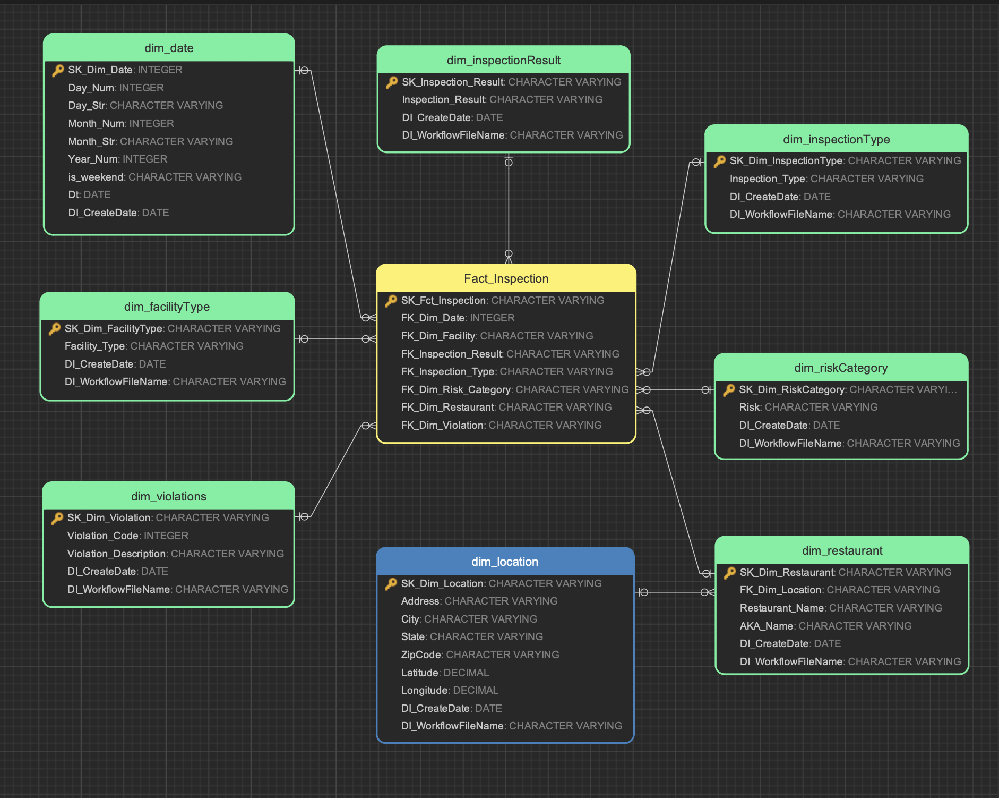

# Dimensional Data Model for Food Inspection Analytics

This folder contains the dimensional model design and implementation used for analyzing food inspection data across cities.

---

## Folder Contents

- `dimensional-data-model.ndm2` – ER/Studio data model file  
- `dimensional-data-model_DDL.sql` – SQL script to create dimensional tables  
- `dimensional-data-model-overview.png` – Visual representation of the star schema  

---

## Model Overview

The dimensional model is built around a central fact table `Fact_Inspection`, connected to the following dimensions:

- `dim_date`
- `dim_inspectionResult`
- `dim_inspectionType`
- `dim_riskCategory`
- `dim_restaurant`
- `dim_location`
- `dim_violations`
- `dim_facilityType`

---

### Dimensional Schema Diagram

  

